# 实验三 Vlan基本配置

##  实验目的

（1）了解常见的Vlan划分方法；

（2）熟悉Vlan的工作原理；

（3）掌握Vlan的配置方法；

（4）掌握Vlan间通信的配置方法。

## 实验内容

（1）在一台交换机上分别创建两个vlan，并为它们分配相应的端口，测试vlan内连通性和vlan间连通性。

（2）在两台交换机上分别创建两个vlan，并为它们分配相应的端口，测试vlan内连通性和vlan间连通性。

（3）通过三层交换机实现Vlan间通信，并测试结果。

（4）抓包分析Vlan间通信时，数据包是如何变化的（从IP地址、MAC地址、MAC帧的格式等方面描述）

## 实验过程

（首先把网络拓扑放前面）

### 1-实验拓扑

1. 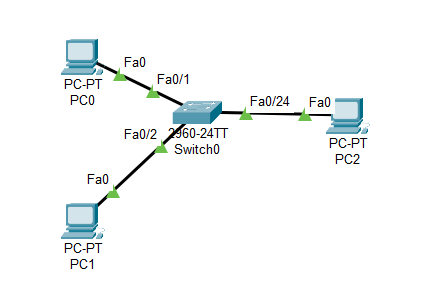
2. 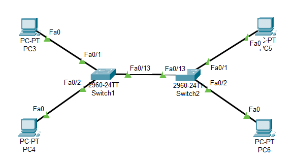
3. 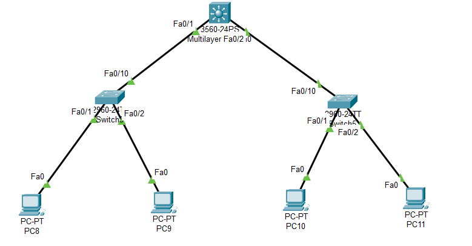

### 2-实验步骤

(1) 在一台交换机上分别创建两个vlan，并为它们分配相应的端口，测试vlan内连通性和vlan间连通性。

1. 画出图1的拓扑结构，配置IP地址，并标注

   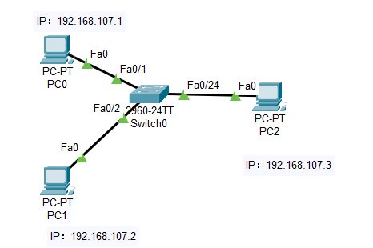

2. 在交换机上创建两个VLAN(vlan10,vlan20)，将PC0、PC1连接的端口划分到vlan10下，将PC3连接的端口划分到vlan20

   - 创建VLAN

     - 命令行

       ```powershell
       switch#configure  t					!进入全局模式
       switch(config)#vlan 10				!创建vlan 10
       switch(config-vlan)#name vlan10		!命名为vlan10
       Switch(config)#vlan 20				!创建vlan 20
       Switch(config-vlan)# name vlan20 	!命名为vlan20
       Switch#show vlan                 	!显示vlan配置
       ```

     - 图形化

       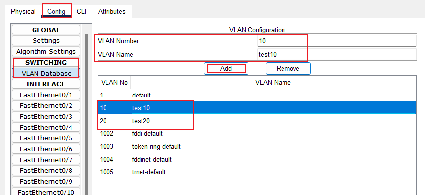

   - 划分端口

     ```powershell
     Switch(config)# interface range  fa 0/1-2     	!进入接口配置模式
     Switch(config-if)#switchport mode access
     Switch(config-if)#switchport access vlan 10   	!将f0/1-2端口加入vlan 10中
     Switch(config)#interface fastethernet 0/24   	!进入f0/24的接口配置模式
     Switch(config-if)#switchport mode access
     Switch(config-if)#switchport access vlan 20    	!将f0/3端口加入vlan 20中
     ```

     效果图

     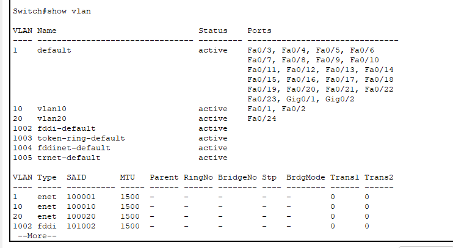

     

     

   3. 通过ping命令测试主机间连通性

   - 内连通性

   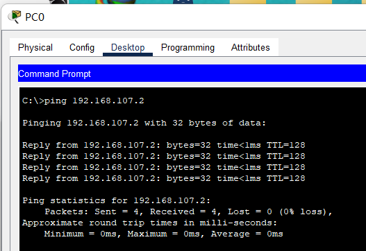
   - 间连通性

     

（2）在两台交换机上分别创建两个vlan，并为它们分配相应的端口，测试vlan内连通性和vlan间连通性。

1. 画出图2的拓扑结构，配置IP地址，并标注

   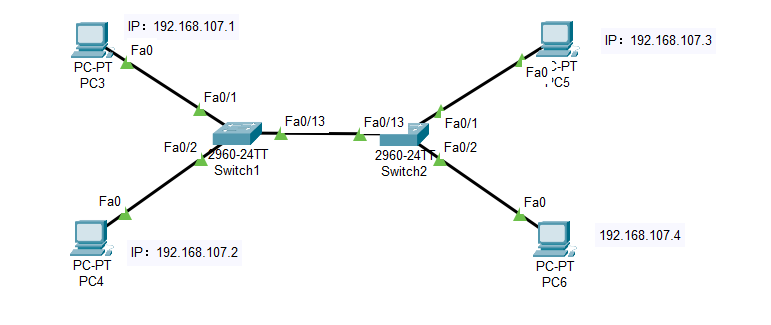

2. 依次在两台交换机上创建两个VLAN（vlan10、vlan20），并将交换机互连的端口设置为trunk模式

   ```powershell
   Switch>enable
   Switch#configure t
   Switch(config)#interface fastethernet 0/1		!进入接口配置模式
   Switch(config-if)#switchport mode access
   Switch(config-if)#switchport access vlan 10   	!将f0/1端口加入vlan 10中
   Switch(config)#interface fastethernet 0/2   	!进入f0/2的接口配置模式
   Switch(config-if)#switchport mode access
   Switch(config-if)#switchport access vlan 20    	!将f0/2端口加入vlan 20中
   Switch(config)#interface fastethernet 0/13   	!进入f0/3的接口配置模式
   Switch(config-if)#switchport mode trunk
   ```

3. 通过ping命令测试主机间连通性

   - 内连通性
   
     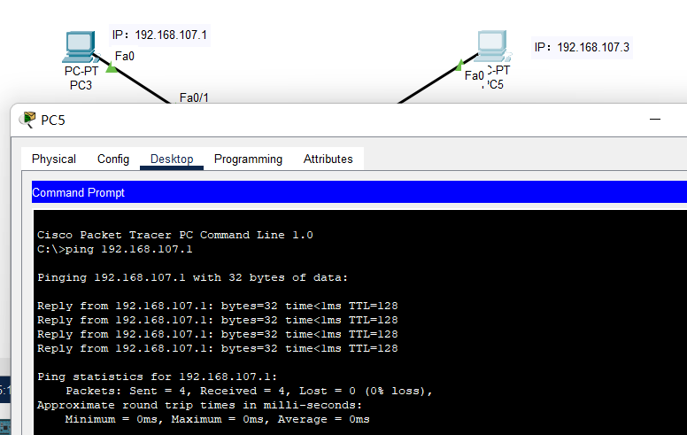
   
   - 间连通性
   
     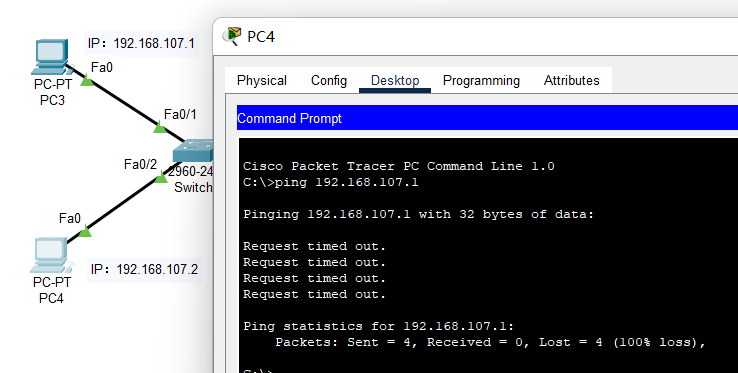

（3）通过三层交换机实现Vlan间通信，并测试结果。

1. 画出图3的拓扑结构，配置IP地址，并标注

   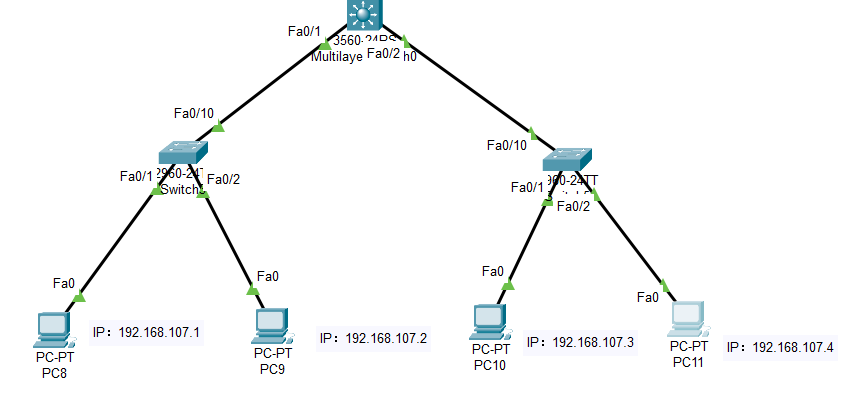

2. 依次在中间两层的交换机中创建vlan10、vlan20，将PC8、PC10连接的端口划分到vlan10,将PC9、PC11连接的端口划分到vlan20,将交换机互联的端口更改为trunk模式

   ```powershell
   Switch>enable
   Switch#configure t
   Switch(config)#interface fastethernet 0/1		!进入接口配置模式
   Switch(config-if)#switchport mode access
   Switch(config-if)#switchport access vlan 10   	!将f0/1端口加入vlan 10中
   Switch(config)#interface fastethernet 0/2   	!进入f0/2的接口配置模式
   Switch(config-if)#switchport mode access
   Switch(config-if)#switchport access vlan 20    	!将f0/2端口加入vlan 20中
   Switch(config)#interface fastethernet 0/10   	!进入f0/10的接口配置模式
   Switch(config-if)#switchport mode trunk
   ```

   
   
3. 通过ping命令测试主机间连通性

   - 内连通性

     

   - 间连通性

## 实验结果分析（实验原理）

#### VLAN间通信

抓包分析VLAN间通信时，数据包是如何变化的（从IP地址、MAC地址、MAC帧的格式等方面描述），即分析VLAN打标签和去标签的过程。


#### Access和Trunk

 

## 回答问题

（1）**说明划分虚拟局域网的意义。**

1. 安全性：VLAN可以将网络按照不同的用户组或应用场景进行划分，从而控制不同用户或设备之间的通信，有效地防止未经授权的访问和攻击。此外，在VLAN中设置ACL（存取控制列表），可以对数据包进行过滤和验证，进一步提高网络的安全性。
2. 可管理性：VLAN可以将网络分为多个逻辑区域，每个区域可以有自己的管理员，符合公司内部的权限管理和责任分工。同时，在VLAN中可以集中管理相同类型的设备，简化了网络管理的工作量。
3. 灵活性：VLAN可以根据需要进行随时调整，添加或删除设备都不会影响其他VLAN的正常运行。这使得企业或机构能够更加灵活地组织网络结构，快速响应变化的业务需求。

（2）**交换机在配置VLAN前后，冲突域和广播域各有什么不同？**

​	在交换机配置VLAN之前，所有端口都处于同一个冲突域和广播域中。这意味着如果有两台设备同时向网络发送数据包，则数据包会在传输介质上发生碰撞，导致数据丢失或损坏，并可能影响其他设备的通信。

​	然而，当交换机配置了VLAN后，每个VLAN都成为一个独立的冲突域和广播域。这意味着在同一VLAN内的设备可以直接通信，而与不同VLAN内的设备则需要经过路由器才能通信。同时，在每个VLAN中，交换机只会将数据包转发到需要接收该数据包的端口，避免了数据包的广播和冲突。

​	因此，配置VLAN可以有效地隔离网络流量，提高网络的安全性和可靠性，同时也提高了网络的灵活性和可管理性。但是需要注意的是，正确配置VLAN需要考虑网络拓扑结构、物理连接和子网划分等因素，否则可能会导致网络故障或性能问题。