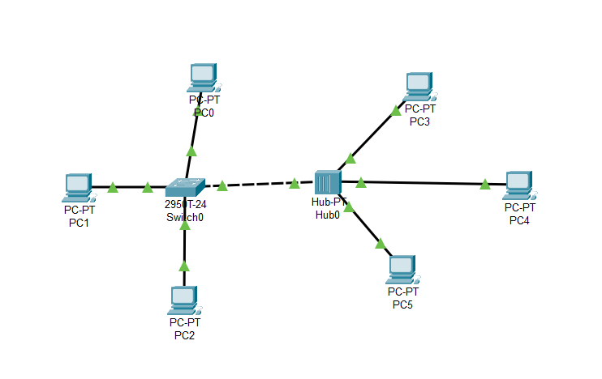
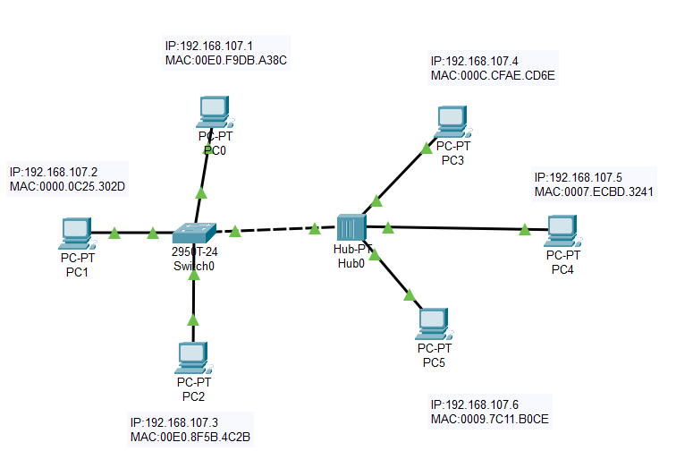
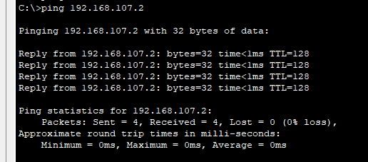
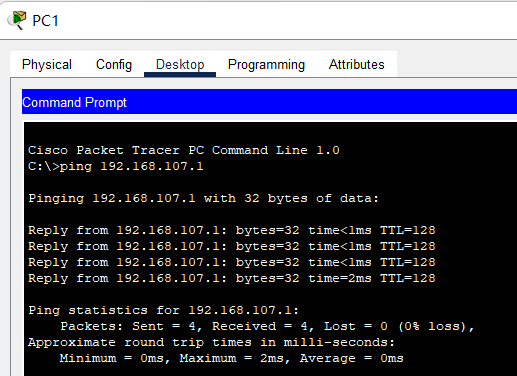
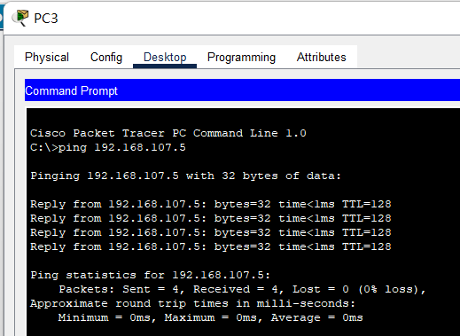
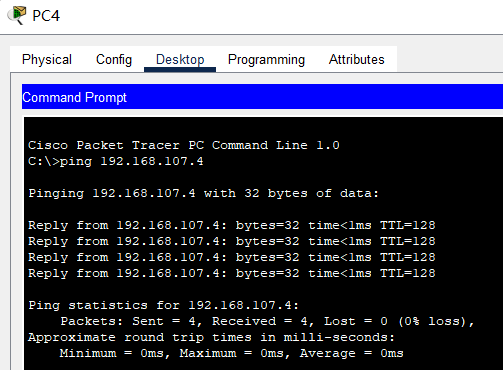
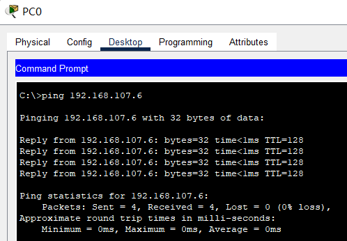
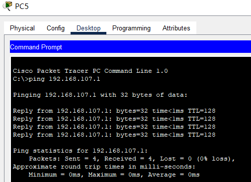
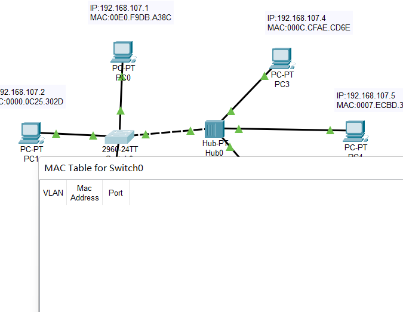
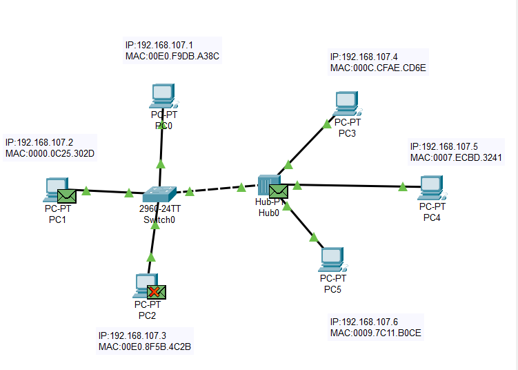

# **实验二**  **交换机与路由器的基本配置**

##  实验目的

（1）了解交换机与路由器的几种配置模式；

（2）掌握Cisco Packet Tracer的用法；

（3）掌握交换机的自学习算法；

（4）掌握交换机与路由器的基本配置命令使用。

## 实验内容

（1）交换机路由器常用命令使用；

（2）交换机上连接三台主机和一台集线器，测试主机联通性；

（3）抓包分析交换机自学习算法，交换机地址表是如何生成的，交换机和集线器转发包有何区别。

## 实验过程

### 1-实验拓扑



### 2-实验步骤

（1）交换机路由器常用命令

```powershell
arp -d						#用于清除主机中的arp缓存
enable						#交换机升级为root权限
clear mac-address-table		#root权限下，清除交换机的MAC-Table
ping $(ip)					#例如 ping 192.168.0.1 作用：测试主机之间的连通性
exit						#退出
```

（2）交换机上连接三台主机和一台集线器，测试主机联通性

- 画出上面的拓扑结构，给主机分配IP地址，并标注IP和MAC地址

  

- 测试主机连通性

  - PC0->PC1

    

  - PC1->PC0

    

  - PC3->PC4

    

  - PC4->PC3

    

  - PC0->PC5

    

  - PC5->PC0

    

（3）抓包分析交换机自学习算法，交换机地址表是如何生成的，交换机和集线器转发包有何区别。

1. 分析交换机

- 清空交换机MAC-Table

  

- 抓包分析，PC0->PC1

  

  - 第一次交换机给所有的主机全部转发了数据包

  - 第二次直接转发给了目标主机

2. 分析集线器
   - 第一次转发给所有连接的主机
   - 第二次同样转发给所有连接的主机

### 3-实验结果分析（实验原理）

#### 3.1 交换机自学习过程分析

1. MAC地址的学习：当一个交换机收到一个数据帧时，它会检查该数据帧的源MAC地址，并将该地址与进入端口相关联。如果这个MAC地址之前没有被记录过，那么交换机就会把这个MAC地址和它的进入端口信息添加到一个内部的MAC地址表中。
2. 广播帧的洪泛：如果交换机在MAC地址表中找不到目标MAC地址对应的出口端口，则它会将该帧发送到所有的出口端口上（除了进入端口），以便让目标设备响应。
3. MAC地址表的更新：当交换机接收到一个数据帧并且该帧目的MAC地址已经存在于MAC地址表中时，交换机就会转发该帧到相应的出口端口。同时，交换机还会更新该MAC地址的条目的时间戳，以保持MAC地址表的最新状态。
4. MAC地址表的老化：为了防止MAC地址表中的条目无限增长，交换机会定期检查每个条目的时间戳，并删除超时的条目。如果一个条目超过一定时间没有更新，则交换机会认为该设备已经离开了网络，从而删除该条目。

#### 3.2 交换机和集线器转发数据包的区别

- 交换机和集线器都是用于在局域网内转发数据包的网络设备，但是它们的工作原理有很大的不同。

- 集线器是一种简单的设备，它的作用是将所有连接到它上面的设备组成一个共享的网络。当一个设备发送一个数据包到集线器时，集线器会将该数据包广播到所有连接到它上面的设备，从而使得所有设备都能够收到这个数据包。这样做的问题是，如果多个设备同时向集线器发送数据包，就会出现冲突，导致数据包丢失或损坏。

- 交换机是一种更复杂的设备，它可以有效地解决集线器出现的冲突问题。交换机通过学习每个连接设备的 MAC 地址并维护一个 MAC 地址表，来实现针对特定设备的单独转发。当一个设备发送一个数据包到交换机时，交换机首先查找目的 MAC 地址，并将数据包只转发到与该地址关联的端口，从而避免了广播数据包带来的冲突问题。此外，交换机还可以根据不同的 VLAN（虚拟局域网）进行数据包的隔离和筛选，提高了局域网的安全性。

- 总体来说，集线器只是将所有设备组成一个共享的网络，而交换机可以实现针对特定设备的单独转发，避免了冲突问题，并提高了网络的性能和安全性。

#### 3.3 集线器的碰撞（冲突）

- 集线器是一种网络设备，用于将多个计算机连接到同一个局域网中。在使用集线器时，如果两个或更多的计算机同时传输数据，则会发生碰撞（也称为冲突），这可能会导致数据包的丢失和网络性能下降。

- 当一个计算机发送数据时，集线器会将该数据包广播到所有连接的计算机。如果另一个计算机正在发送数据，它也会广播到所有计算机。这种情况下，两个数据包可能会在同一时间到达同一个计算机，导致碰撞。

- 为了解决这个问题，以太网采用了CSMA/CD协议。这个协议要求每个计算机在发送数据之前先监听网络，确保没有其他计算机正在发送数据。如果有多个计算机同时开始发送数据，它们会检测到碰撞，并暂停发送数据。随后，计算机会等待一个随机时间段后重新尝试发送数据。

- 虽然CSMA/CD协议可以减少碰撞，但仍无法完全避免。当网络上的负载增加时，碰撞的发生率也会增加。因此，现代网络通常使用交换机代替集线器，交换机具有更高的性能和可靠性，可以避免碰撞的发生。

## 回答问题

（1）说明交换机路由器的几种工作模式。

交换机和路由器是计算机网络中常用的两种设备，它们各自有不同的工作模式。

交换机的工作模式包括：

1. 学习模式：当交换机收到数据帧时，会学习源MAC地址，并将其存储在交换表中。此后，如果需要将数据发送到该MAC地址，交换机就可以直接将数据转发到相应端口。
2. 转发模式：当交换机收到数据帧时，会查询交换表，以确定目标MAC地址所对应的端口。然后，交换机将数据转发到该端口上。
3. 洪泛模式：当交换机无法找到目标MAC地址所对应的端口时，会将数据帧广播到所有端口上。这种情况通常发生在交换机的交换表中缺少目标MAC地址信息时，或者交换机需要将数据帧发送到多个目标设备时。

而路由器的工作模式包括：

1. 静态路由：管理员手动配置路由表，指定数据包的下一跳地址。
2. 动态路由：通过协议（如RIP、OSPF等）自动学习网络拓扑结构，并更新路由表。
3. NAT（网络地址转换）：将私有网络地址转换成公网地址，使得内部网络能够访问Internet。
4. ACL（访问控制列表）：用于限制或允许特定IP地址或端口号的数据流入/出路由器。
5. VPN（虚拟专用网络）：通过加密技术建立安全的通信隧道，实现远程办公、远程访问等功能。

这些工作模式使得交换机和路由器可以实现各种不同的网络功能，如提高局域网的性能和可靠性，连接不同子网之间的通信，控制网络访问和保障网络安全等。

（2）简要叙述交换机的自学习算法。

​	交换机的自学习算法是指交换机在接收到数据帧时，能够通过分析源MAC地址和端口信息，自动学习并构建出一个"MAC地址表"，以便更快、更准确地将数据帧转发给目标设备。

​	具体来说，当交换机收到一条数据帧时，会先检查数据帧中的目标MAC地址是否已经在自己的MAC地址表中存在，并根据表中存储的端口信息直接将数据帧转发给相应的端口。如果目标MAC地址不在表中，则交换机会将该数据帧广播发送至所有端口（除了接收该数据帧的端口），以便让其他设备学习到该MAC地址。同时，交换机会将该数据帧中的源MAC地址和对应接收端口信息添加到自己的MAC地址表中，以便之后更快地转发数据帧。

​	随着时间的推移，交换机的MAC地址表会不断更新，以适应网络拓扑结构的变化。例如，当某个设备从一个端口移动到另一个端口时，交换机会在MAC地址表中更新该设备的MAC地址和对应的端口信息。这样，当有数据帧发送给该设备时，交换机就能够快速将其转发到正确的端口上，从而提高网络性能和可靠性。

​                    

 

 

 

 