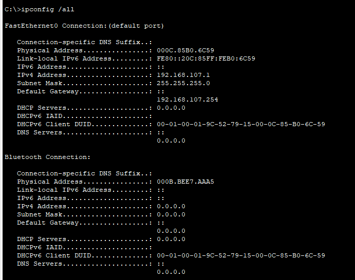

# 实验四  常用网络测试命令

##  实验目的

（1）掌握一些常见命令的使用；

（2）掌握命令的含义和相关操作。

## 实验内容

ipconfig命令、ping命令、Netstat命令、tracert命令、nslookup命令、ARP命令、Telnet命令

## 实验过程

（首先把网络拓扑放前面。将实验内容中每个命令的执行结果截图贴到报告中，并对结果进行分析。）

### 1-ipconfig命令及分析

IPConfig用于显示当前TCP/IP配置
ipconfig:显示每个已经配置的接口的IP地址、子网掩码和缺省网关值。
ipconfig/all: 当使用all选项时，IPConfig能为DNS和WINS服务显示它已经配置且所要使用的附加信息(如IP地址等)，并且显示内置于本地网卡中的物理地址 (MAC)

### 2-ping命令及分析（重点）

- ping /?查看支持的参数扩展命令: 

- ping x.x.x.x -t连续ping目标主机，直到按Ctrl+C停止

- ping x.x.x.x - 1000 指定测试包大小，默认为32字节，本例为1000字节，包大小范围1-65500

- ping x.x.x.x-n 100 指定发送测试包的数量，本例为100个

  > 注意:ping - 大包会造成网络延时，大延时对检测网络稳定性很有帮助。ping -t 不间断发ping包

### 3-netstat命令及分析

Netstat用于显示与IP、TCP、UDP和ICMP协议相关的统计数据，一般用于检验本机各端口的网络连接情况。

- -a 显示所有有效连接信息列表，包括已建立连接(ESTABLISHED)与监听连接请求 (LISTENING)的连接。
- -r 显示路由表信息
- -s 按照各协议分别显示其统计数据。如果应用程序或浏览器运行速度较慢，或者不能显示Web页之类的数据可以用本选项来查看所显示的信息。
- -e 显示以太网统计数据。它列出了发送和接收端的数据报数量，包括传送的数据报的总字节数、错误数、删除数、数据报的数量和广播的数量，可用来统计基本的网络流量。
- -n 以数字形式显示当前连接
- -an 查看及侦听当前TCP/UDP连接

### 4-tracert命令及分析

 测试从本机到目的地址的所有路由信息，一般最多显示30跳。

###  5-nslookup命令及分析

NSLOOKUP是操作系统中连接DNS服务器，查询域名信息的一个非常有用的命令
nslookup 必须要安装了 TCP/IP 协议的网络环境之后才能使用

### 6-arp命令及分析

ARP(地址解析协议)是一个重要的TCP/IP协议，用于确定对应IP地址的网卡物理地址。ARP命令能够查看本地或另一台计算机的ARP高速缓存中的当前内容。

- arp-a 显示所有arp cache中的数据- 

- arp -d 删除(清cachearp -s 10.38.40.200-aa-00-62-c6-09

  静态添加IP地址与MAC地址对应关系(针对arp欺骗病毒)

  

### 7-telnet连接三层交换机

####  7-1 实验过程

1. 在三层交换机上配置密码

   

2. 查看IP

   

3. 使用telnet远程连接

   

#### 7-2 实验测试及结果分析

任意一台主机都可以连接到三层交换机，实验成功

Telnet连接成功，说明本地计算机和三层交换机之间的网络连接正常，同时也确认了三层交换机支持Telnet功能。在Telnet连接成功后，可以进行相关的配置和管理操作，这对于网络管理员来说非常重要。同时，需要注意的是，在进行Telnet连接时，需要确保账号和密码的安全性，防止被未授权用户恶意攻击。

## 回答问题

（1）当不能访问外部主机时，怎样进行故障诊断？

1. 确认本地计算机的网络连接是否正常，例如检查本地计算机的IP地址、子网掩码、默认网关等设置是否正确
2. 使用ping命令测试本地计算机与外部主机之间的网络连通性，例如：ping [www.google.com](http://www.google.com/)，若无法ping通，则说明出现了问题
3. 如果ping不通外部主机，可以尝试ping同一局域网内的其他主机，如果都ping不通，则可能是本地计算机或局域网内的设备出现了故障，例如网线松动或设备故障等
4. 如果只有ping不通某个特定的外部主机，可以尝试使用tracert命令来跟踪路由信息，查看从本地计算机到目标主机之间经过的所有中间设备，在这个过程中分析哪一个设备导致了网络故障，并逐一排除

（2）tracert如何探测各中间结点的IP地址和终点的IP地址？

1. 打开命令提示符窗口（或终端窗口），输入“tracert”命令后加上目标主机的IP地址或域名，例如：tracert [www.google.com](http://www.google.com/)
2. 按下回车键后，tracert会依次对目标主机发出一系列ICMP数据包，并记录每个数据包的经过路径。
3. tracert将逐一显示每个经过的中间节点的IP地址、对应的DNS名称（如果有）、响应时间（以毫秒为单位）等信息

 

 

 

 